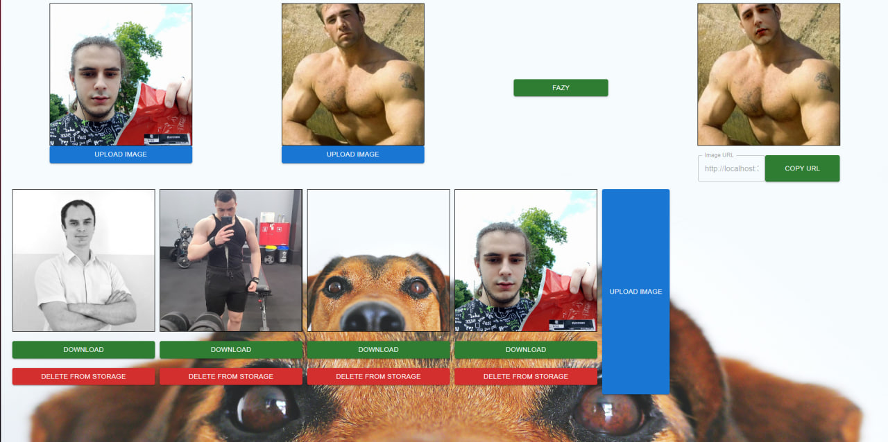
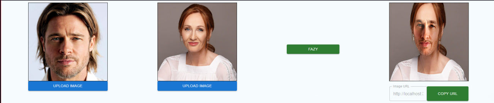
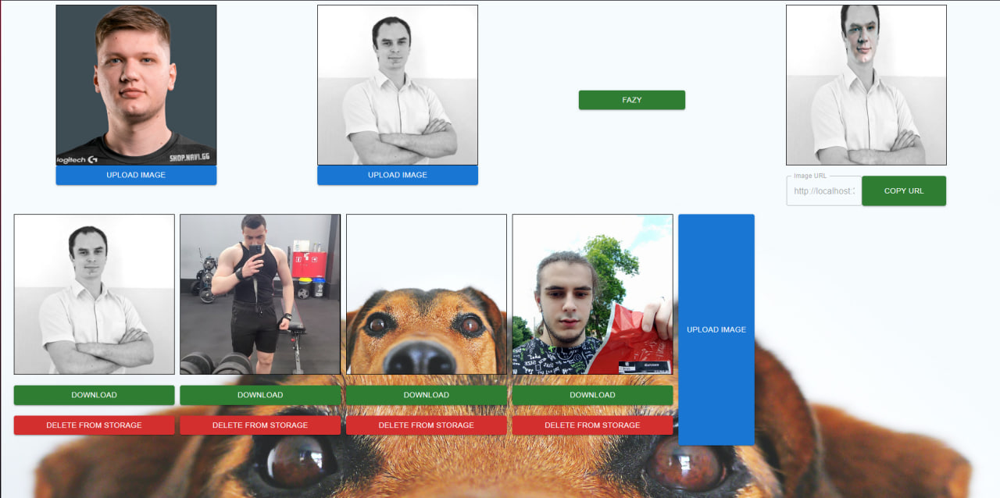

# Free deepfake app. Use it on local machine



# You also need cmake [Click here for more information](https://cmake.org/download/).

# Add cmake to enviroment

```bash
pip install opencv-python
pip install cmake
pip install dlib
```

# Install dependencies and use it on localhost:5173



# FullStack app. Uses Backend, Frontend and CV (Computer vision)


